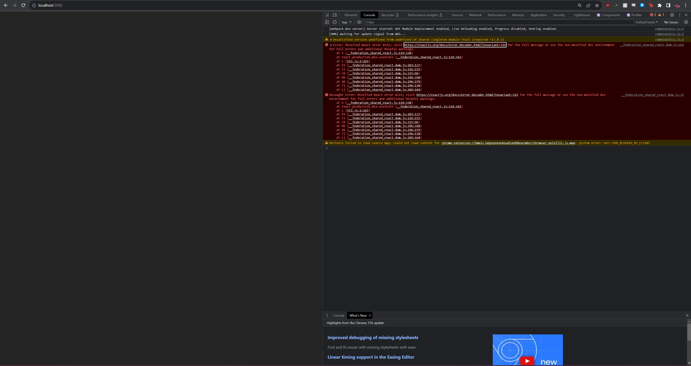
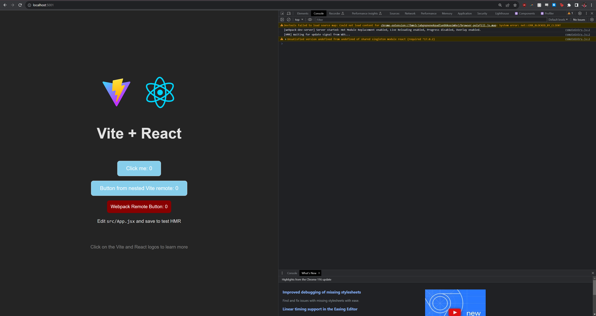
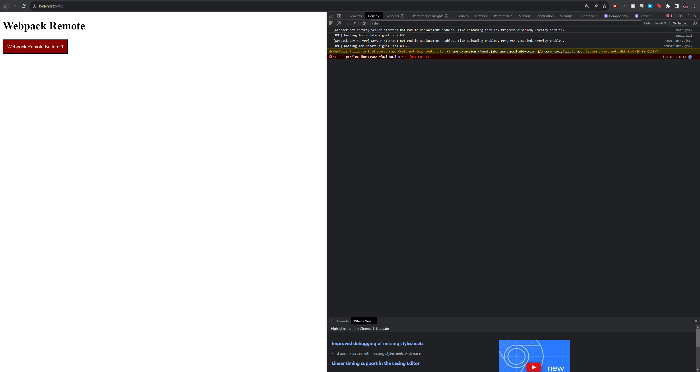
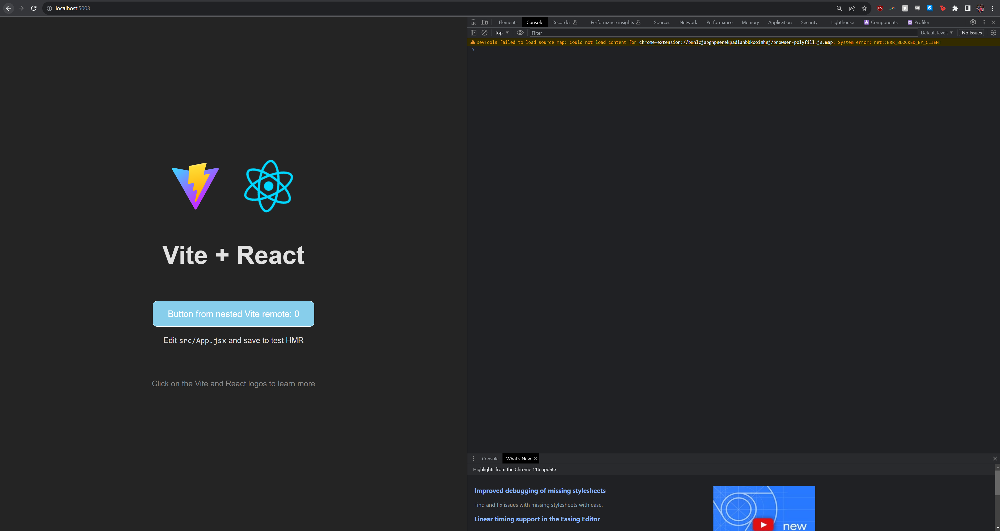

# React - Vite Federation Demo

This example demos consumption of federated modules. There are a total of 3 remotes configured to be imported by the host application. 

- `host` (React + Vite based) depends on a component exposed by `remote` app (React + Vite based).
- `remote` (React + Vite based) depends on button components exposed by `nested-vite-remote` (React + Vite based) and `nested-webpack-remote` (React + Webpack based).
- `nested-vite-remote` (React + Vite based) exports a simple React button with an internal state counter
- `nested-webpack-remote` (React + Webpack based) exports a simple React button with an internal state counter

## Running

Install `pnpm` as per instructions provided [here](https://pnpm.io/installation)

Run `pnpm install`, then `pnpm run start:all` to start all applications locally using `concurrently`. This will build and serve `host`, `remote`, `nested-vite-remote` on ports 5000, 5001, and 5003 respectively. This will also start the webpack server for `nested-webpack-remote` on port 5002.

- HOST: [localhost:5000](http://localhost:5000/)
- REMOTE: [localhost:5001](http://localhost:5001/)
- NESTED-WEBPACK-REMOTE: [localhost:5002](http://localhost:5002/)
- NESTED-VITE-REMOTE: [localhost:5003](http://localhost:5003/)

`CTRL + C` can be used to kill the execution of `concurrently`.

## Error Summary
Viewing each individual remote application loads successfully:
- REMOTE: [localhost:5001](http://localhost:5001/)
- NESTED-WEBPACK-REMOTE: [localhost:5002](http://localhost:5002/)
- NESTED-VITE-REMOTE: [localhost:5003](http://localhost:5003/)

However when attempting to import the `remote` federated module that includes `nested-webpack-remote`, there appears to be a clash with the shared REACT dependency and we receive the React minified error for [#321](https://legacy.reactjs.org/docs/error-decoder.html/?invariant=321) - Invalid hook call.

## Screenshots for quick reference
- HOST: [localhost:5000](http://localhost:5000/)

- REMOTE: [localhost:5001](http://localhost:5001/)

- NESTED-WEBPACK-REMOTE: [localhost:5002](http://localhost:5002/)

- NESTED-VITE-REMOTE: [localhost:5003](http://localhost:5003/)
